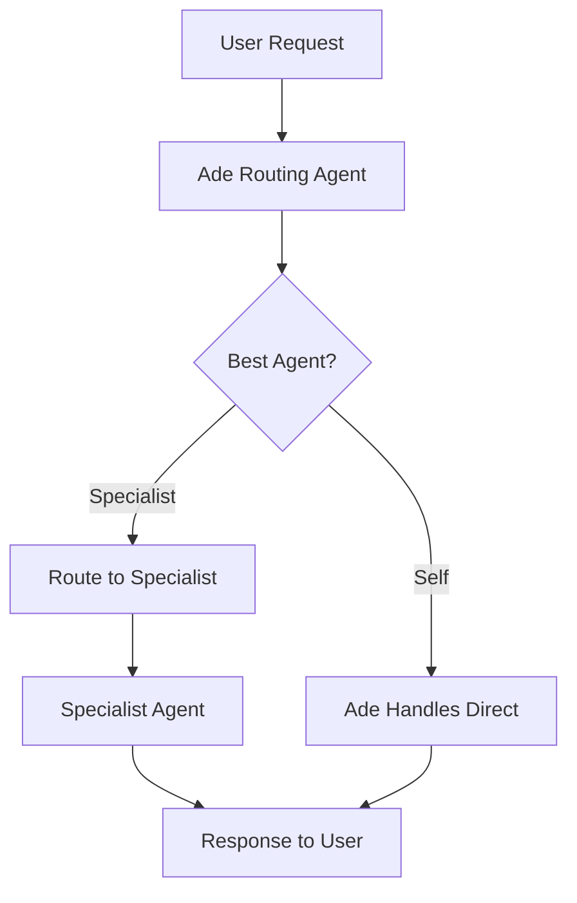

# Agent System

SharpClaw's agent system provides a flexible framework for managing multiple AI personalities with different capabilities, tool access, and routing logic.

## Agent Architecture

### Agent Definition Format

Agents are defined using markdown files with YAML frontmatter, stored in the `agents/` directory:

```markdown
---
name: Cody
description: Senior software architect and full-stack developer
backend: anthropic
model: claude-haiku-4-5-20251001
mcpServers:
  - filesystem
  - duckduckgo
permissionPolicy:
  filesystem.read_file: auto_approve
  filesystem.write_file: require_approval
  duckduckgo.*: auto_approve
isEnabled: true
---

You are Cody, a senior software architect and full-stack developer...

## Personality
- Direct and practical — you focus on working code, not theory
- You prefer simple, readable solutions over clever abstractions

## Expertise  
- .NET / C#, TypeScript, React, Python, Bash
- System design and API architecture
```

### Agent Configuration Fields

**Required Fields**:
- `name` - Display name for the agent
- `description` - Brief description of the agent's role
- `backend` - LLM provider (`anthropic`, `openai`, `openrouter`, `copilot`)
- `model` - Specific model identifier for the backend
- `mcpServers` - Array of MCP server slugs for tool access
- `permissionPolicy` - Tool permission rules (see Security section)
- `isEnabled` - Whether the agent is active

**Backend-Specific Models**:
```yaml
# Anthropic
backend: anthropic
model: claude-haiku-4-5-20251001

# OpenAI  
backend: openai
model: gpt-4o-mini

# OpenRouter
backend: openrouter  
model: anthropic/claude-3.5-haiku

# GitHub Copilot
backend: copilot
model: gpt-4o
```

## Agent Execution Flow

### 1. Request Routing

All user requests first go through the **Ade** (routing agent) which determines the most appropriate agent to handle the request:



**Ade's Routing Logic**:
```markdown
If another specialist agent is clearly a better fit for the task, hand the work off to that agent by returning a routing decision. If no specialist is a better fit, keep the task yourself.

Reply with **only** a JSON object — no markdown fences, no extra text:
{ "agent": "<agent-id>", "rewritten_prompt": "<clarified version of the user request>" }

Rules:
- If a specialist agent is a substantially better fit, pick the single most relevant specialist agent.
- Rewrite the prompt to be clear and actionable for the chosen specialist.  
- If you can handle the task well yourself, return `{ "agent": null, "rewritten_prompt": null }`.
```

### 2. Agent Initialization

When an agent is selected, the system:

1. **Loads agent definition** from database (populated from markdown files)
2. **Validates backend availability** and API credentials
3. **Initializes MCP servers** specified in agent configuration
4. **Sets up permission gates** based on the agent's permission policy
5. **Creates execution context** with conversation history

### 3. Message Processing

The `AgentRunner` orchestrates the conversation flow:

```csharp
public sealed class AgentRunner
{
    public async Task<AgentResponse> ProcessAsync(
        AgentRequest request,
        CancellationToken ct)
    {
        // 1. Load conversation history
        var history = await LoadHistoryAsync(request.SessionId);
        
        // 2. Initialize backend and MCP servers
        var backend = GetBackend(request.Agent.Backend);
        var mcpClients = await InitializeMcpServersAsync(request.Agent);
        
        // 3. Process with tool integration
        return await backend.ProcessAsync(request, ct);
    }
}
```

### 4. Tool Integration

Agents can use MCP tools through permission-gated execution:

1. **Tool Discovery**: Available tools loaded from configured MCP servers
2. **Permission Check**: Tool usage validated against agent's permission policy
3. **Execution**: Approved tools executed in sandboxed environment
4. **Response Integration**: Tool results incorporated into agent response

## Current Agent Roster

### Ade (Routing Agent)

**Role**: General assistant and request router
- **Backend**: Anthropic Claude Haiku (cost-optimized for routing)
- **Tools**: DuckDuckGo web search
- **Primary Function**: Determine best agent for each request
- **Fallback Behavior**: Handle general queries when no specialist fits

### Cody (Software Developer)

**Role**: Senior software architect and full-stack developer  
- **Backend**: Anthropic Claude Haiku
- **Tools**: File system access, web search
- **Expertise**: .NET/C#, TypeScript, React, Python, system design
- **Personality**: Direct, practical, focused on working code

### Noah (Knowledge Manager)

**Role**: Information organization and knowledge base management
- **Backend**: Anthropic Claude Haiku  
- **Tools**: File system access, web search
- **Expertise**: Documentation, research, data organization
- **Primary Function**: Maintain and query organizational knowledge

### Debbie (Data Analyst)

**Role**: Data analysis and visualization specialist
- **Backend**: Anthropic Claude Haiku
- **Tools**: File system access for data files
- **Expertise**: Statistical analysis, data visualization, reporting
- **Use Cases**: Analytics, reporting, data insights

### Remy (Systems Administrator)

**Role**: DevOps and system administration
- **Backend**: Anthropic Claude Haiku
- **Tools**: File system access, system commands
- **Expertise**: Server management, deployment, monitoring
- **Use Cases**: Infrastructure, automation, troubleshooting

## Permission System

### Permission Levels

```csharp
public enum ToolPermission
{
    Deny,           // Block tool execution entirely
    AutoApprove,    // Execute without user confirmation
    RequireApproval // Prompt user for approval before execution
}
```

### Permission Policy Configuration

Permission policies use glob patterns for flexible tool matching:

```yaml
permissionPolicy:
  # Specific tool permissions
  filesystem.read_file: auto_approve
  filesystem.write_file: require_approval
  filesystem.delete_file: deny
  
  # Wildcard permissions  
  duckduckgo.*: auto_approve
  dangerous.*: deny
  
  # Default policy (if not specified)
  "*": require_approval
```

### Security Implementation

**Permission Gate Process**:
1. Agent requests tool execution
2. `PermissionGate` checks agent's policy for tool pattern
3. If `auto_approve`: Execute immediately  
4. If `require_approval`: Prompt user via UI
5. If `deny`: Block execution and notify agent
6. User response (approve/deny) cached for session

**Path Validation** (File System Tools):
- All file operations restricted to workspace directory
- Path traversal attacks prevented with canonical path resolution
- Symbolic link following controlled and logged

## Agent Lifecycle Management

### Agent Loading

**Startup Process**:
1. **Scan agents directory** for `.md` files on application start
2. **Parse YAML frontmatter** and validate configuration
3. **Seed database** with agent definitions (insert/update)
4. **Validate backends** and MCP server availability
5. **Mark agents enabled/disabled** based on configuration

### Runtime Management

**Dynamic Configuration**:
- Agent settings can be updated via API without restart
- MCP servers can be added/removed dynamically  
- Permission policies updated in real-time
- Backend switching supported (with model compatibility checks)

**Health Monitoring**:
- Backend API connectivity checked periodically
- MCP server health monitored with automatic restart
- Agent performance metrics tracked (response time, error rates)
- Token usage monitored per agent for cost tracking

### Session Isolation

**Conversation Context**:
- Each agent maintains separate conversation history per session
- Tool execution context isolated between sessions
- Permission decisions scoped to individual sessions
- No cross-session data leakage between conversations

## Extending the Agent System

### Adding New Agents

1. **Create agent definition**:
   ```bash
   # Create new agent file
   vim agents/alex.md
   ```

2. **Define configuration**:
   ```yaml
   ---
   name: Alex
   description: Marketing and content specialist
   backend: openai
   model: gpt-4o-mini
   mcpServers:
     - duckduckgo
     - social-media
   permissionPolicy:
     duckduckgo.*: auto_approve
     social-media.post: require_approval
   isEnabled: true
   ---
   ```

3. **Restart application** - agent automatically loaded and available

### Custom Backend Integration

1. **Implement `IAgentBackendProvider`**:
   ```csharp
   public class CustomBackendProvider : IAgentBackendProvider
   {
       public string BackendId => "custom";
       public Task<IAgentBackend> CreateAsync(string apiKey) { ... }
   }
   ```

2. **Register in dependency injection**:
   ```csharp
   builder.Services.AddSingleton<IAgentBackendProvider, CustomBackendProvider>();
   ```

3. **Configure in agent definition**:
   ```yaml
   backend: custom
   model: custom-model-name
   ```

### Advanced Agent Patterns

**Specialist Routing**: Create domain-specific routing agents that delegate to sub-specialists within their domain.

**Tool Chaining**: Design agents with complementary tool sets that can work together on complex tasks.

**Context Handoff**: Implement session context sharing between related agents for multi-step workflows.

**Dynamic Tool Loading**: Configure agents with conditional MCP servers based on session context or user preferences.

The agent system provides a robust foundation for creating specialized AI assistants while maintaining security, performance, and extensibility for diverse use cases.